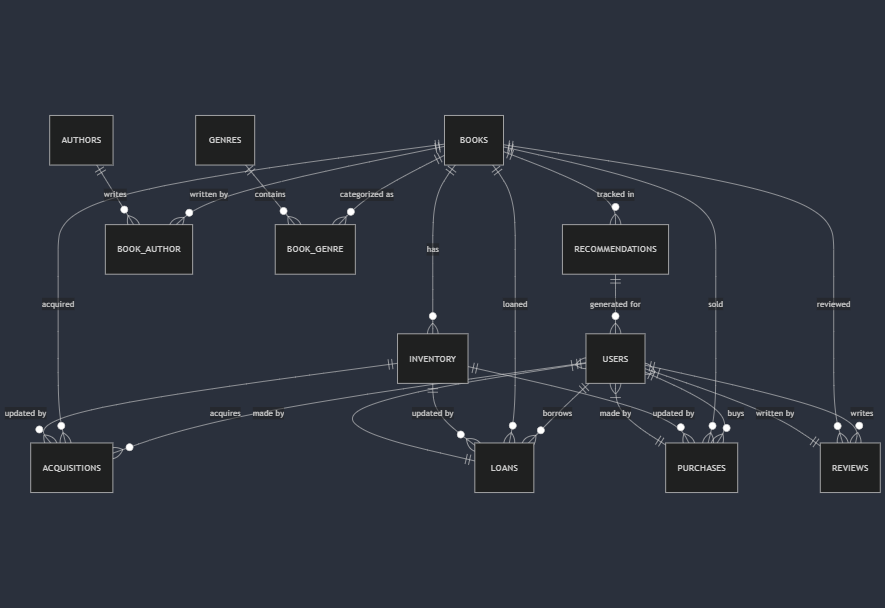

# Design Document

By Straulea Mariana

Video overview: <[https://youtu.be/nmsqVUV3aVs]>

## Scope

The database for the online library includes all entities necessary to facilitate the process of tracking book aquisition, user accounts, as well as purchases or loans made by such users. Included in the database's scope, is:

* User accounts, including basic identifing informations as well as the country, address, email and password account
* Books, including the name and price of each book
* Book inventory, including book stocks that are meant for selling or loaning purposes and basic identifying information
* Authors, including basic identifying informations
* Book genres, including the type
* Book acquisitions, witch includes information about the amount, purpose, date and basic identifying informations
* Loans and Purchases, that include information about the users as well as books, transaction dates and return dates where applies
* User reviews, including feedback, rating and basic identifying information
* Recommandations, basic identifying information based of past purchases

* Outside the scope of the database are elements like bank transactions between the store and costumers, store employs and other ono-core attributes

## Functional Requirements

This database will support:

* CRUD operations for users, books, authors and genres
* Tracking all kind of books, including books written by multiple authors or books that have multiple genres
* Tracking user purchases as well as loans
* Keep track of an inventory for the books in the library

Note that in this iteration, the system will not support the bank transactions between users and the library.
## Representation
Entities are captured in SQLite tables with the following schema.

### Entities
The database includes the following entities:

#### Users

The `users` table includes:
* `id`, which specifies the unique ID for the user as an `INT`. This column thus has the `PRIMARY KEY` constraint applied.
* `first_name` , which specifies the user's first name as `VARCHAR(34)`, given `VARCHAR` is appropriate for name fields.
* `last_name`, which specifies the users's last name. `VARCHAR(34)` is used for the same reason as `first_name`.
* `username`, which specifies the user's library account username. `VARCHAR(64)` is used for the same reason as `first_name`. A `UNIQUE` constraint ensures no two students have the same account username.
* `email`, which specifies the user's email address. It is stored as `VARCHAR(128)`, ensuring sufficient space for various email formats. The `UNIQUE` constraint ensures no two users can register with the same email address.
* `password_hash`, which stores the hashed version of the user's password as `VARCHAR(128)`. Storing a hashed password instead of plain text enhances security.
* `country`, witch records a users country of residence. It is stored as `VARCHAR(64)`, allowing flexibility for different country names.
* `address`, which specifies the user's residential address as `VARCHAR(128)`.
* `phone_number`, which stores the user's contact number in `VARCHAR(15)`. The length of 15 characters is sufficient for most international phone number formats.
* INDEX `username_index` (`username`), which creates an index on the `username` column. This index improves query performance when searching for users by their username.
* INDEX `user_email_index` (`email`), which creates an index on the `email` column. This enhances efficiency when looking up users by their email address, especially in large datasets.

#### Books

The `books` table includes:

* `id`, which serves as the unique identifier for each book. It is defined as an `INT`.This column has a `PRIMARY KEY` constraint applied
* `name`, which specifies the title of the book. It is stored as `VARCHAR(64)`, providing enough space for book titles.
* `price`, which records the book's price as a `DECIMAL(10,2)`. This format allows for prices with up to ten digits in total, including two decimal places for cents. The `DEFAULT NULL` setting means that a book's price can be left unspecified.
* INDEX `book_title_index` (`name`), which creates an index on the `name` column. This improves the efficiency of lookups based on book titles, enhancing query performance when searching for books by name.

#### Inventory

The `inventory` table includes:
* `id`, which serves as the unique identifier for each `inventory` record. It is defined as an `INT`. The PRIMARY KEY constraint guarantees uniqueness.
* `book_id`, which references the `id` column in the `books` table. It is stored as `INT` `NOT NULL`, ensuring that every inventory entry is linked to a valid book. The `FOREIGN KEY` constraint enforces referential integrity, and `ON DELETE CASCADE` ensures related inventory records are removed if a book is deleted.

* `stock_for_sale`, which represents the number of copies available for sale. It is stored as `TINYINT` with a `DEFAULT VALUE` of `0`.
* `stock_for_loan`, which specifies the number of copies available for loan. Like `stock_for_sale`, it is defined as `TINYINT`  with a `DEFAULT VALUE` of `0`.
* INDEX `inventory_book_id_index` (`book_id`), which creates an index on the `book_id` column to improve query performance when searching for inventory records by book ID.

#### Authors

The `authors` table includes:

* `id`, which serves as the unique identifier for each author. It is defined as an `INT` with the `AUTO_INCREMENT` attribute, ensuring automatic increment for new entries. The `PRIMARY KEY` constraint guarantees uniqueness.

* `birth_year`, which specifies the author's year of birth. It is stored as `SMALLINT(4)`, ensuring that only valid years are recorded while optimizing storage.
* `name`, which stores the author's full name. It is defined as `VARCHAR(64)`, providing sufficient space for the authors full name
* INDEX `book_author_index` (`name`), which creates an index on the `name` column to improve search performance when querying authors by name.

#### Book Author

The `book_author` table includes:

* `id`, which serves as the unique identifier for each book-author relationship. It is defined as an `INT` and has a `PRIMARY KEY` constraint applied.
* `book_id`, which specifies the `id` of the book associated with the `author`. It is stored as `INT`. The `FOREIGN KEY ` constraint enforces referential integrity, and `ON DELETE CASCADE` ensures that if a book is deleted, all related records in this table are also removed.
* `author_id`, which specifies the `id` of the `author` linked to the `book`. It is stored as `INT` ensuring that every record is associated with a valid `author`. The `FOREIGN KEY` constraint maintains data integrity, and `ON DELETE CASCADE` ensures that if an author is deleted, all related book-author records are removed.
* INDEX `book_author_book_id_index` (`book_id`), which creates an index on the `book_id` column to optimize queries searching for books by `author`.
* INDEX `book_author_id_index` (`author_id`), which creates an index on the `author_id` column to enhance search performance when querying authors by `book`.

#### Genres

The `genres` table includes:

* `id`, which serves as the unique identifier for each `genre`. It is defined as an `INT` and has a `PRIMARY KEY` constraint applied.
* `genre`, which stores the genre type. It is defined as `VARCHAR(64)`, providing sufficient space for any genre.

#### Book Genre

The `book_genre` table includes:

* `id`,  which serves as the unique identifier for each book-genre relationship. It is defined as an `INT` and has a `PRIMARY KEY` constraint applied.
* `book_id`, which specifies the `id` of the `book` associated with a `genre`. It is stored as `INT`, ensuring that every record links to a valid book. The `FOREIGN KEY` constraint enforces referential integrity, and `ON DELETE CASCADE` ensures that if a book is deleted, all its related genre associations are also removed.
* `genre_id`, which specifies the `id` of the `genre` linked to a `book`. It is stored as `INT`, ensuring that every record is associated with a valid genre. The `FOREIGN KEY` constraint maintains data integrity, and `ON DELETE CASCADE` ensures that if a genre is deleted, all related book-genre records are removed.
* INDEX `book_genre_genre_id` (`genre_id`), which creates an index on the `genre_id` column to optimize queries filtering books by genre.
* INDEX `book_genre_book_id` (`book_id`), which creates an index on the `book_id` column to enhance search performance when retrieving genres associated with a book.

#### Acquisitions

The `acquisitions` table includes:

* `id`, which serves as the unique identifier for each acquisition record. It is defined as an `INT` with the `AUTO_INCREMENT` attribute, ensuring automatic increment for new entries. The `PRIMARY KEY` constraint guarantees uniqueness.
`book_id`, which specifies the `id` of the book involved in the transaction. It is stored as `INT`, The `FOREIGN KEY` constraint enforces referential integrity, and `ON DELETE CASCADE` ensures that if a book is deleted, all related acquisition records are also removed.
* `for_sale`, which indicates whether the acquired book was intended for sale. It is defined as a `BOOLEAN` `DEFAULT FALSE`, ensuring that this field always has a valid value.
* `for_loan`, which specifies whether the acquired book was intended for lending. Like `for_sale`, it is defined as a `BOOLEAN` `DEFAULT FALSE`, ensuring clarity in the purpose of acquisition.
* `amount`, which records the number of books acquired in the transaction. It is stored as `TINYINT` `NOT NULL DEFAULT 0`, optimizing storage while ensuring that the quantity is always specified.
* `datetime`, which stores the timestamp of the acquisition. It is defined as a `TIMESTAMP` `DEFAULT CURRENT_TIMESTAMP`, automatically recording when the transaction occurred.
* INDEX `book_id_acquisition_index` (`book_id`), which creates an index on the `book_id` column to improve query performance when retrieving acquisition records by book.

#### Loans

The `loans` table includes:

* `id`, which serves as the unique identifier for each loan record. It is defined as an `INT` with the `AUTO_INCREMENT` attribute, ensuring automatic increment for new entries. The `PRIMARY KEY` constraint guarantees uniqueness.
* `book_id`, which specifies the `id` of the borrowed book. It is stored as `INT`, the `FOREIGN KEY` constraint enforces referential integrity, and `ON DELETE CASCADE` ensures that if a book is deleted, all related loan records are also removed.
* `user_id`, which specifies the `id` of the user who borrowed the book. It is stored as `INT`. The `FOREIGN KEY` constraint maintains data integrity, and `ON DELETE CASCADE` ensures that if a user is deleted, all their loan records are also removed.
* `loan_date`, which records the date and time when the book was borrowed. It is defined as a `TIMESTAMP` `DEFAULT CURRENT_TIMESTAMP`, automatically capturing the loan moment.
* `return_date`, which specifies the date and time when the book was returned. It is stored as a `TIMESTAMP` `DEFAULT NULL`, allowing it to remain empty until the book is returned.
* `returned`, which indicates whether the book has been returned. It is defined as a `BOOLEAN` `DEFAULT FALSE`, ensuring clarity in tracking book returns.
* INDEX `user_id_book_id_loan_history_index` (`user_id`, `book_id`), which creates a composite index on the `user_id` and `book_id` columns to optimize queries retrieving loan records based on both user and book.

#### Purchases

The `purchases` table includes:

* `id`, which serves as the unique identifier for each purchase record. It is defined as an `INT` with the `AUTO_INCREMENT` attribute, ensuring automatic increment for new entries. The `PRIMARY KEY` constraint guarantees uniqueness.
* `book_id`, which specifies the `id` of the purchased book. It is stored as `INT`, the `FOREIGN KEY` constraint enforces referential integrity, and `ON DELETE CASCADE` ensures that if a book is deleted, all related purchase records are also removed.
* `user_id`, which specifies the `id` of the user who purchased the book. It is stored as `INT`, the `FOREIGN KEY` constraint maintains data integrity, and `ON DELETE CASCADE` ensures that if a user is deleted, all their purchase records are also removed.
* `purchase_date`, which records the date and time when the book was purchased. It is stored as a `TIMESTAMP DEFAULT NULL`, allowing flexibility in case the date is not immediately available.
* INDEX `user_id_book_id_purchase_history_index` (`user_id`, `book_id`), which creates a composite index on the `user_id` and `book_id` columns to optimize query performance when retrieving purchase records by user and book.

#### Reviews

The `reviews` table includes:
* `id`, which serves as the unique identifier for each review. It is defined as an `INT` with the `AUTO_INCREMENT` attribute, ensuring automatic increment for new entries. The `PRIMARY KEY` constraint guarantees uniqueness.
* `book_id`, which specifies the `id` of the reviewed book. It is stored as `INT`, the `FOREIGN KEY` constraint enforces referential integrity, and `ON DELETE CASCADE` ensures that if a book is deleted, all related reviews are also removed.
* `user_id`, which specifies the `id` of the user who wrote the review. It is stored as `INT`, ensuring that every review is associated with a valid user. The `FOREIGN KEY` constraint maintains data integrity, and `ON DELETE CASCADE` ensures that if a user is deleted, all their reviews are also removed.
* `stars`, which records the rating given by the user. It is stored as a `TINYINT NOT NULL` with a `CHECK` constraint ensuring values are between 1 and 5, preventing invalid ratings.
* `comment`, which stores the user’s written feedback about the book. It is defined as `TEXT DEFAULT NULL`, allowing flexibility if a user chooses to leave only a rating without a comment.
* `datetime`, which captures the timestamp of when the review was submitted. It is stored as a `TIMESTAMP` `DEFAULT CURRENT_TIMESTAMP`, ensuring automatic recording of the review time.
* INDEX `user_book_id_review_index` (`user_id`, `book_id`), which creates a composite index on the `user_id` and `book_id` columns to optimize search performance when retrieving reviews by user and book.

#### Recomandations

The `recommendations` table includes:

* `id`, which serves as the unique identifier for each recommendation. It is defined as an `INT` with the `AUTO_INCREMENT` attribute, ensuring automatic increment for new entries. The `PRIMARY KEY constraint guarantees uniqueness.
* `book_id`, which specifies the `id` of the recommended book. It is stored as `INT NOT NULL`, ensuring that every recommendation is linked to a valid book. The `FOREIGN KEY` constraint enforces referential integrity, and `ON DELETE CASCADE` ensures that if a book is deleted, all related recommendations are also removed.
* `user_id`, which specifies the `id` of the user who made the recommendation. It is stored as `INT NOT NULL`, ensuring that every recommendation is associated with a valid user. The `FOREIGN KEY` constraint maintains data integrity, and `ON DELETE CASCADE` ensures that if a user is deleted, all their recommendations are also removed.

### Relationships

The below entity relationship diagram describes the relationships among the entities in the database.

As detailed by the diagram:

* One user can make 0 to many purchases, tracked in the purchases table. A purchase is associated with one and only one book. A book can belong to 0 to many purchases, depending on whether users have bought it.
* One user can make 0 to many loans, tracked in the loans table. Each loan is associated with one and only one book, and a book can be loaned 0 to many times, depending on availability.
* One user can write 0 to many reviews, each linked to a single book. A book can have 0 to many reviews, depending on whether users have reviewed it.
* One user can acquire 0 to many books, tracked in the acquisitions table. An acquisition is associated with one and only one book, and a book can be acquired multiple times to update stock.
* One book can belong to 0 to many purchases and loans, as it may be bought or borrowed multiple times. Each purchase or loan is linked to one book.
* One book can have 0 to many inventory records, which are updated through acquisitions, loans, and purchases.
* One book can have 0 to many authors, while an author can write 0 to many books, forming a many-to-many relationship.
* One book can belong to 0 to many genres, while a genre can categorize 0 to many books, forming another many-to-many relationship.
* The recommendations table tracks all books that have been purchased. This can be used to generate recommendations based on past purchases.

## Optimizations

* Per the typical queries in the system, it is common for users of the database to search for books by title. For that reason, an index is created on the `name` column in the `books` table to speed up searches for books.
* Similarly, users are often identified by their username and email address. To facilitate efficient lookups, indexes are created on the `username` and `email` columns in the `users` table.
* To improve the efficiency of book-related queries, indexes are added to `book_id` in multiple tables such as `inventory`, `acquisitions`, `purchases`, `loans`, and `reviews`, ensuring fast access when filtering data by book.
* Since authors are frequently searched by name, an index is created on the name column in the authors table` to optimize lookups.
* For the many-to-many relationships between books and their authors, as well as books and their genres, indexes are applied to `book_id` and `author_id` in the `book_author` table, and to `book_id` and `genre_id` in the `book_genre` table, allowing for quick retrieval of books by author and genre.
* To enhance performance when retrieving loan history or purchase records for a given user, composite indexes are created on (`user_id`, `book_id`) in both the `loans` and `purchases` tables.
* A view (`available_books`) is also created to provide a consolidated view of all available books along with their `authors`, `genres`, and `stock availability`. This optimizes common queries where users wish to see available books without performing multiple complex joins.
* Additionally, triggers are implemented to automatically update the inventory when books are acquired, loaned, sold, or returned. This ensures that stock availability remains accurate and minimizes the need for redundant queries.

## Limitations

* The current schema assumes fixed book pricing, which may not support dynamic pricing or discounts.
* Recommendations tracks purchased books but do not account for personalized suggestions based on user behavior.
* Inventory management does not distinguish between different book conditions such as: new, used, damaged.
* Loans are recorded per book, assuming one book per transaction.
* Reviews are linked to books but not specific editions, which may be necessary for distinguishing between different releases.
